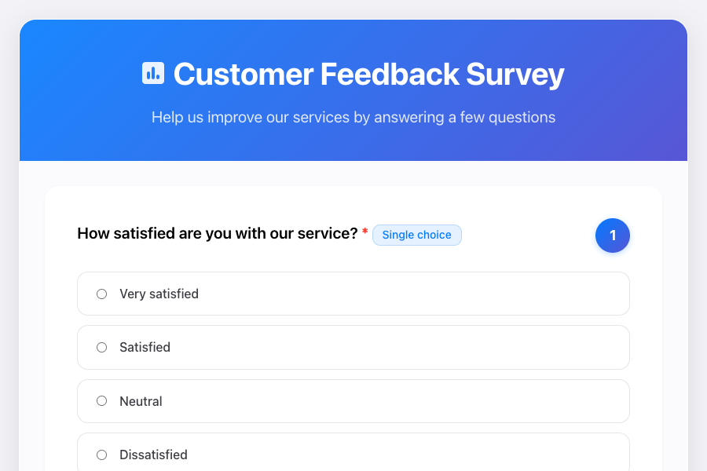
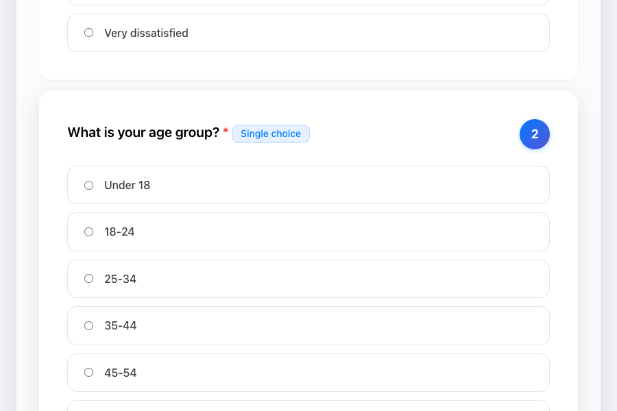

# Swift NIO Survey Server

A full-stack survey application with SwiftNIO backend and modern HTML/JS/CSS frontend. Collect customer feedback through a web interface with real-time progress tracking.

## 🚀 Quick Start

### Prerequisites

#### macOS
1. **Check if Swift is already installed**:
   ```bash
   swift --version
   ```
   If this shows Swift 5.7 or higher, you can skip to step 3.

2. **Install Swift** (if not installed or version is too old):
   - **Option A**: Install Xcode Command Line Tools (includes Swift):
     ```bash
     xcode-select --install
     ```
   - **Option B**: Install Swift directly from [swift.org](https://www.swift.org/download/)
   - **Option C**: Install via Homebrew:
     ```bash
     brew install swift
     ```

3. **Verify installation**:
   ```bash
   swift --version
   ```
   Should show Swift 5.7 or higher.

#### Linux
1. **Install Swift** from [swift.org/download](https://www.swift.org/download/)
2. **Add to PATH** as instructed in the download
3. **Verify installation** with `swift --version`

### Installation & Running

1. **Clone the repository**
   ```bash
   git clone <repository-url>
   cd AI_hw_3
   ```

2. **Build the server**
   ```bash
   swift build
   ```
   This downloads SwiftNIO dependencies and compiles the project.

3. **Run the server**
   ```bash
   swift run
   ```
   The server starts on `http://127.0.0.1:8080`

4. **Open in browser**
   Navigate to `http://127.0.0.1:8080`

5. **Test the API**
   ```bash
   curl http://127.0.0.1:8080/health
   curl http://127.0.0.1:8080/questions
   ```

## 📋 Features

- **SwiftNIO Backend**: High-performance HTTP server
- **Responsive Frontend**: Modern UI with CSS design tokens
- **Multiple Question Types**: Text, single-choice, and multiple-choice
- **Real-time Progress**: Visual progress bar and answer count
- **Server Status**: Live connection indicator
- **In-memory Storage**: Thread-safe answer storage

## 🏗️ Architecture

### Backend (Swift)
```
Sources/SwiftServer/
├── Application/     # Server setup, routes, dependencies
├── Models/         # Data models (Question, Answer, etc.)
├── Configuration/  # Question provider
├── Router/         # Routing logic
├── Storage/        # Answer storage
└── Utilities/      # File reading, JSON coding, constants
```

### Frontend (HTML/JS/CSS)
```
public/
├── index.html      # Main page
├── css/           # Stylesheets
└── js/            # JavaScript logic
```

## 🌐 API Endpoints

### Core Business Endpoints
These endpoints are essential for the survey functionality:

| Method | Endpoint | Description |
|--------|----------|-------------|
| GET | `/questions` | Returns all survey questions (JSON) |
| POST | `/answers` | Submits user answers (JSON) |

### Supporting Endpoints
These endpoints support the application but aren't core to business logic:

| Method | Endpoint | Description |
|--------|----------|-------------|
| GET | `/` | Serves frontend HTML |
| GET | `/health` | Health check (used by frontend for connection status) |
| GET | `/css/style.css` | Frontend CSS |
| GET | `/js/script.js` | Frontend JavaScript |

### Example API Usage
```bash
# Health check
curl http://127.0.0.1:8080/health

# Get questions
curl http://127.0.0.1:8080/questions

# Submit answers
curl -X POST http://127.0.0.1:8080/answers \
  -H "Content-Type: application/json" \
  -d '{"answers": [{"questionId": 1, "answer": "Very satisfied"}]}'
```

### Endpoint Recommendations
- **Essential for production**: `/questions`, `/answers`, `/`, static files
- **Useful for monitoring**: `/health` (used by frontend for connection status)

## 🖥️ UI Overview

### Main Interface


The survey form loads questions dynamically with connection status indicator.

### Progress Tracking


Real-time progress bar updates as users answer questions.

## 🔧 Development

### Building
```bash
# Debug build (default)
swift build

# Release build
swift build -c release

# Clean build artifacts
swift package clean
```

### Project Structure
- **Package.swift**: Swift package configuration with SwiftNIO dependency
- **Sources/**: Swift server source code
- **public/**: Frontend assets (HTML, CSS, JS)
- **screenshots/**: Application screenshots

### Adding Questions
Edit `Sources/SwiftServer/Configuration/QuestionProvider.swift` to modify survey questions.

## 📦 Dependencies

- **SwiftNIO**: Apple's non-blocking I/O framework
- **Foundation**: Swift standard library

## 🎯 Use Cases

- Customer feedback collection
- Market research surveys
- Employee satisfaction tracking
- Product development feedback
- SwiftNIO learning example

## 🔄 Application Flow

1. User loads page → Frontend fetches questions from `/questions`
2. User answers questions → Progress updates in real-time
3. User submits → Answers sent to `/answers`
4. Success confirmation shown

## 🛠️ Troubleshooting

### Port Already in Use
If port 8080 is occupied, modify `ServerConstants.swift` to use a different port.

### Swift Version Issues
Ensure Swift 5.7+ is installed:
```bash
swift --version
```

### Build Errors
Clean and rebuild:
```bash
swift package clean
swift build
```

## 📄 License

Educational project - free to use and modify.

---

**Ready to collect feedback? Run `swift run` and open `http://127.0.0.1:8080`!**